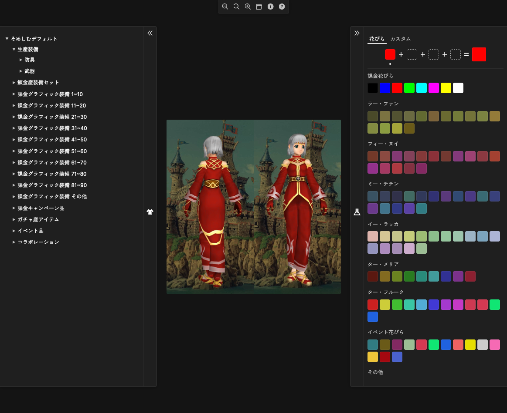

# MoE そめしむ


## アプリケーション URL

<https://pocka.github.io/moe-somesim/>

## これは何？

MoE ([Master of Epic](http://moepic.com), 日本の MMORPG) の染色システムをシミュレーションするブラウザアプリです。
まず染色したい装備を選んでから染色に利用する花びらを 1 枚以上選ぶと、ゲーム内と同じように装備の染色を行うことができます。



## ライセンス

`data/images/` 配下の画像はスクリーンショットとなるため、 Master of Epic の権利保有者が著作権を有します。

```
(C)MOE K.K. (C)Konami Digital Entertainment 株式会社MOE及び株式会社コナミデジタルエンタテインメントの著作権を侵害する行為は禁止されています。
```

それ以外のコード・データに関しては Apache License 2.0 が適用されます。

- [ライセンス全文](./LICENSE)

## ドキュメント

- [変更履歴](./CHANGELOG.md)
- [コントリビュートに関する諸々](./CONTRIBUTING.md)
