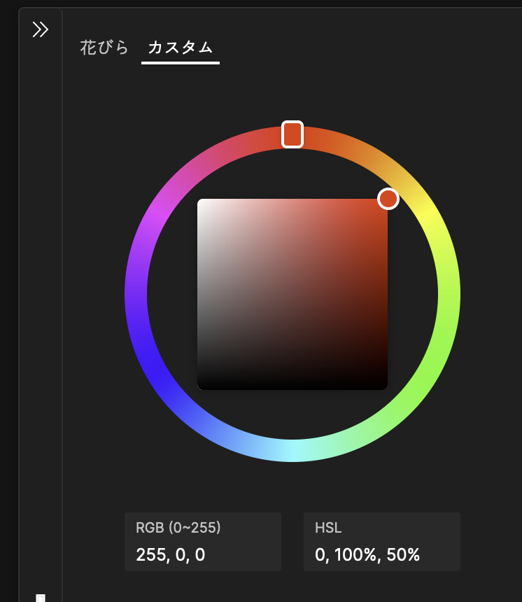

# そめしむの使い方

## 画面の見方

そめしむの画面は「プレビュー」「装備ツリー」「色パネル」「操作パネル」の 4 つから成り立っています。

## 基本的な操作

装備ツリーから装備を選び色パネルで染めたい色を作ると、プレビュー上にシミュレートされた染色済みの装備画像が表示されます。

## 装備の選び方

### 装備ツリー

装備はグループごとにまとまっているため、グループを展開してシミュレートしたい装備を選んでください。
グループは名前の横に `▼` が、装備は名前の横に `○` が表示されます。
現在選択中の装備にはラジオボタンのチェックが入ります。

装備ツリーはキーボードの矢印キーと <kbd>Space</kbd> 及び <kbd>Enter</kbd> で操作することもできます。

### 画像を直接読み込む

そめしむは v5 からアプリケーションに組み込まれていないユーザ生成の画像も読み込めるようになりました。
ユーザ生成画像の読み込みを行う方法は複数あります。

- 画像ファイルをドラッグ & ドロップする
- 画像を他の web サイトやアプリケーションから直接ドラッグ & ドロップする (ブラウザによって対応していません)
- 画像をクリップボードにコピーしてから、そめしむ上でペーストする
  - ブラウザのアプリケーションメニュー (例: `編集 > 貼り付け`)
  - キーボードショートカット (Windows, Linux: <kbd>Ctrl + V</kbd>, macOS: <kbd>Cmd + V</kbd>)
- 操作パネルのフォルダアイコンをクリックして画像ファイルを選択する

なお、正しく生成されなかった画像やフォーマットが異なる画像を読み込むと正しくシミュレートされません。

そめしむ画像を生成する方法に関しては [画像生成マニュアル](./BUILD_IMAGE.md) を参照してください。

## 色の作り方

### 花びらを使って染色液を合成する

ゲーム内に実際に存在する花びらを合成して染色液を作ります。
色パネルの `花びら` タブを選ぶと花びらの一覧と染色液のスロットが表示されます。

上部にあるスロットの左側 4 つに花びらを入れることができ、その合成結果が一番右の少し大きい枠にプレビューされます。

下に小さいドットが表示されているスロットが現在アクティブなスロットです（スクリーンショットだと一番左のスロット）。
アクティブではないスロットをクリックすると、そのスロットをアクティブにすることができます。
現在アクティブなスロットもう一度クリックすると、そのスロットを空にすることができます。

スロットの下に表示されている花びらの中のどれかをクリック・タップすると、現在アクティブなスロットにその花びらが設定されます。

また、花びらをドラッグしてスロットにドロップすることもできます。
ドラッグ & ドロップの場合はスロットをアクティブにせずに直接設定できます。

<video muted src="./flower-dnd.mov" loop autoplay></video>

### HSV で直接色を選ぶ

色パネルの `カスタム` タブを選ぶと色相ホイールと、明度・彩度のスライダーを使って色を自在に作ることができます。

ここで作成できる色にはゲーム内で作成できない色も含まれます。
同じ色が作れるか・近い色が作れるかは [逆引き調合シミュレータ](http://wind.noor.jp/mix/mixture.cgi) で調べることができます。
なお、そめしむでは RGB と HS**L** を表示しています。
逆引き調合シミュレータで入力できるのは RGB と HS**V** のため、そめしむで調整した色を逆引きする際には RGB で調べましょう。

## プレビューの操作方法

プレビューの画像は拡大縮小と移動ができます。
操作パネルのズームリセットアイコン（虫眼鏡のフレームが一部かけているもの）をクリックすると、拡大率と移動がリセットされます。

### 拡大

<kbd>Ctrl</kbd> を押しながらマウスホイールを回転させることでズームができます。
タッチ入力やトラックパッド・タッチパッドの場合はピンチ操作でズームができます。

操作パネルのズームイン・ズームアウトアイコンをクリックすることでそれぞれ拡大率を 50%刻みで変更することができます。

### 移動

タッチ、もしくはマウスの主ボタンを押しながらプレビューをドラッグすることで移動が行えます。
マウスホイールを回転させる、トラックパッド・タッチパッドを 2 本指でスワイプすることでも移動は行なえます。
